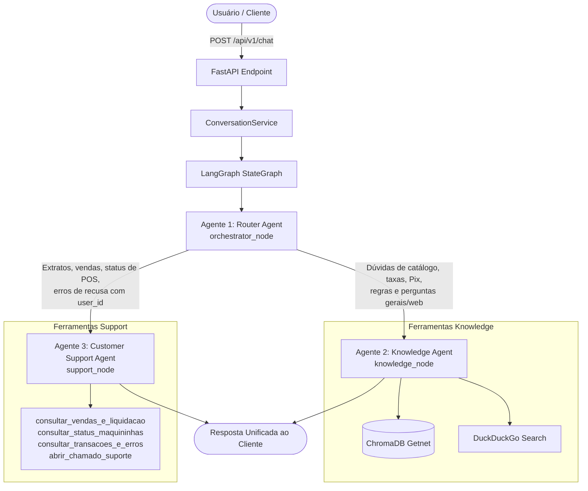

# Getnet Multi-Agent Customer Support System 🚀

Sistema multiagente corporativo construído com **LangGraph**, **FastAPI**, **LangChain** e **ChromaDB**, desenvolvido para atender com alta precisão e conformidade técnica ao desafio **Engenheiro de IA (Nível Avançado) – Sistema de Suporte Multiagente da Getnet**.

---

## 🏛️ Arquitetura e Orquestração Multiagente

O sistema adota um padrão de orquestração com **3 tipos distintos de agentes cooperativos**:



### 1. Agente 1 — Agente Roteador (Router Agent)
- **Papel:** Ponto de entrada principal da orquestração.
- **Mecanismo:** Analisa a semântica da mensagem do usuário e o `user_id` para decidir de forma determinística qual especialista deve processar a solicitação, sem gerar respostas conversacionais diretas.

### 2. Agente 2 — Agente de Conhecimento (Knowledge Agent)
- **Papel:** Processa consultas institucionais da Getnet e perguntas gerais de mundo aberto.
- **Ferramentas:**
  - `consultar_base_getnet`: RAG no ChromaDB persistente alimentado por documentos locais e URLs oficiais.
  - `pesquisar_web`: Busca na web (DuckDuckGo) para cotações (ex: euro hoje), clima em tempo real e dados externos.

### 3. Agente 3 — Agente de Suporte ao Cliente (Customer Support Agent)
- **Papel:** Atendimento autenticado utilizando o identificador único do cliente (`user_id`).
- **Ferramentas:**
  - `consultar_vendas_e_liquidacao`: consulta extrato de vendas de ontem e previsão de liquidação bancária.
  - `consultar_status_maquininhas`: diagnóstico de sinal e conectividade dos terminais do cliente.
  - `consultar_transacoes_e_erros`: identifica recusas de transação (ex: Código 51 - Saldo Insuficiente).
  - `abrir_chamado_suporte`: registro formal de tickets técnicos para a equipe Getnet.

---

## 🔄 Pipeline de RAG e Ingestão Híbrida

O RAG opera com duas camadas complementares:

1. **Arquivos Locais (`fonte_de_dados/`):**
   - Ingestão automática de `.txt`, `.pdf` e `.docx`.
   - **Deduplicação com Hash MD5:** Tabela SQLite `simple_sync_hashes` garante que arquivos inalterados sejam pulados instantaneamente sem custos adicionais de embedding. Quando alterados, os chunks antigos são limpos e substituídos.

2. **Crawler Recursivo de URLs Parametrizadas:**
   - As URLs raiz são parametrizadas no `.env` (`RAG_SYNC_URLS`) com profundidade configurável (`RAG_CRAWLER_MAX_DEPTH`).
   - O crawler varre recursivamente as subpáginas filhas, extrai texto limpo e calcula a assinatura MD5 no SQLite (`url_sync_hashes`).
   - Se uma página for atualizada na web, o sistema deleta os vetores anteriores no ChromaDB vinculados àquela URL (`vectorstore.delete(where={"source": url})`) e reinsere os novos chunks.
   - **Agendamento em Background:** Parametrizado via cron (`RAG_WEB_SYNC_CRON`) ou executável sob demanda:
     ```bash
     python -m backend.infrastructure.rag.sync_web
     ```

---

## 🚀 Como Executar o Projeto

### Opção A: Execução via Docker (Recomendada)

1. Certifique-se de que o Docker e Docker Compose estão instalados.
2. Crie o arquivo `.env` com sua chave:
   ```env
   OPENAI_API_KEY=sk-...
   ```
3. Construa e inicie os containers:
   ```bash
   docker compose up --build
   ```
4. A API estará acessível em:
   - **Swagger UI:** [http://localhost:8001/docs](http://localhost:8001/docs)
   - **Health Check:** [http://localhost:8001/health](http://localhost:8001/health)

### Opção B: Execução Local

1. Crie e ative o ambiente virtual:
   ```bash
   python -m venv .venv
   .\.venv\Scripts\activate       # Windows
   # source .venv/bin/activate    # Linux/Mac
   ```
2. Instale as dependências:
   ```bash
   pip install -r requirements.txt
   ```
3. Inicie o servidor FastAPI (Backend na porta 8001):
   ```bash
   uvicorn backend.main:app --host 0.0.0.0 --port 8001 --reload
   ```
4. Inicie a interface visual (Frontend na porta 3001):
   ```bash
   python -m http.server 3001 --directory frontend
   ```
   Acesse o chat em: [http://localhost:3001](http://localhost:3001)

---

## 🧪 Suíte de Testes Automatizados (10 Cenários Oficiais)

O projeto possui uma bateria de testes automatizados com `pytest` cobrindo **100% dos 10 cenários de teste exigidos na especificação do desafio**:

```bash
pytest tests/test_scenarios.py -v
```

### Resultados dos 10 Cenários Validados:
1. `test_scenario_01_get_classica_vs_smart`: **PASSOU** (Knowledge Agent / RAG Getnet)
2. `test_scenario_02_previsao_tempo_porto_alegre`: **PASSOU** (Knowledge Agent / Web Search)
3. `test_scenario_03_deposito_vendas_ontem`: **PASSOU** (Customer Support / Liquidação `cliente1988`)
4. `test_scenario_04_conta_bancaria_pix`: **PASSOU** (Knowledge Agent / RAG Getnet)
5. `test_scenario_05_maquininha_sem_conexao`: **PASSOU** (Troubleshooting Conexão POS)
6. `test_scenario_06_antecipacao_recebiveis`: **PASSOU** (Knowledge Agent / RAG Getnet)
7. `test_scenario_07_cotacao_euro`: **PASSOU** (Knowledge Agent / Web Search)
8. `test_scenario_08_erro_recusa_transacao`: **PASSOU** (Customer Support / Diagnóstico Erro 51)
9. `test_scenario_09_parcelas_crediario`: **PASSOU** (Knowledge Agent / RAG Getnet)
10. `test_scenario_10_venda_whatsapp_link_pagamento`: **PASSOU** (Knowledge Agent / RAG Getnet)

**Resultado:** `10 passed in ~60s`.

---

## 📡 Contrato da API

### `POST /api/v1/chat`

**Payload de Requisição:**
```json
{
  "message": "Quando o dinheiro das vendas de ontem será depositado?",
  "user_id": "cliente1988"
}
```

**Resposta JSON:**
```json
{
  "response": "Olá! Verifiquei o extrato financeiro da sua conta (Comércio Silva & Santos Ltda). As vendas líquidas de ontem no valor de R$ 1.205,50 têm previsão de depósito para amanhã até às 18h na sua conta cadastrada no Banco Santander (Agência 1234, Conta 98765-4), conforme o prazo contratual de liquidação D+2.",
  "agent_used": "support",
  "category": "Financeiro/Extrato"
}
```

---

## 📹 Roteiro Sugerido para o Vídeo de Apresentação

Para a gravação do seu vídeo aos avaliadores, siga esta estrutura direta (5 a 7 minutos):

1. **Abertura (30 seg):**
   - Apresente seu nome e o objetivo: Sistema de Suporte Multiagente com LangGraph para a Getnet.
2. **Arquitetura da Orquestração (1.5 min):**
   - Mostre o grafo no LangGraph (`START -> orchestrator -> [knowledge | support] -> END`).
   - Explique a responsabilidade de cada agente (Roteador, Knowledge com RAG+Web e Customer Support com dados do `user_id`).
3. **Pipeline de RAG Híbrido (1.5 min):**
   - Demonstre a ingestão de arquivos locais em `fonte_de_dados/` e o crawler recursivo de URLs parametrizadas com detecção de hash MD5 no SQLite e invalidação de versão antiga no ChromaDB.
4. **Demonstração Prática (2 min):**
   - Abra o Swagger (`http://localhost:8000/docs`).
   - Execute o Teste 1 (Comparativo Get Clássica vs Get Smart).
   - Execute o Teste 2 (Previsão do tempo / Web Search).
   - Execute o Teste 3 (Vendas de ontem do `cliente1988` com Customer Support).
5. **Encerramento e Testes (1 min):**
   - Mostre o terminal rodando `pytest tests/test_scenarios.py -v` com os 10 testes passando (`10 passed`).
   - Mencione a conteinerização pronta via `docker compose up --build`.
