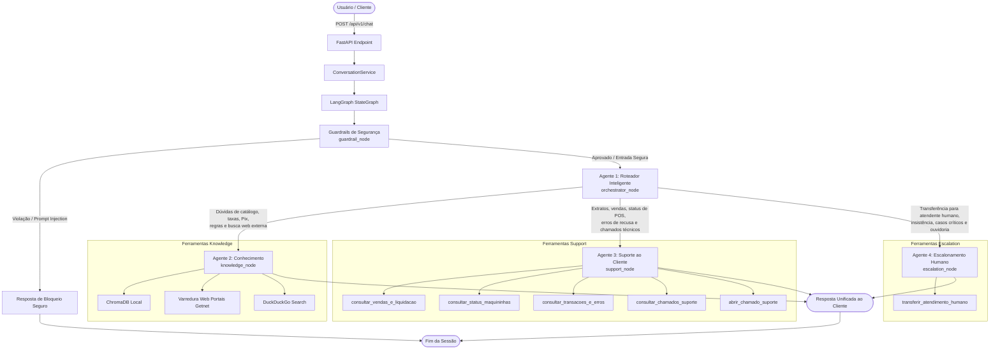

# Getnet Multi-Agent Customer Support System 🚀

Sistema multiagente corporativo construído com **LangGraph**, **FastAPI**, **LangChain**, **ChromaDB** e **OpenAI**, desenvolvido para atender com excelência técnica, resiliência e conformidade integral ao desafio **Engenheiro de IA (Nível Avançado) – Sistema de Suporte Multiagente da Getnet**.

---

## 🏛️ Arquitetura e Orquestração Multiagente

O sistema adota um padrão de orquestração avançado com **Guardrails de Segurança**, **Roteador Semântico** e **3 Agentes Especialistas Cooperativos**, além de retenção de memória conversacional multi-turnos com `MemorySaver`:



---

## 🤖 Os 4 Agentes Especialistas & Camada de Guardrails

### 🛡️ Camada de Guardrails de Segurança (`guardrail_node`)
- **Papel:** Primeira barreira de defesa de entrada do sistema.
- **Mecanismo:** Analisa a mensagem do usuário contra tentativas de *prompt injection*, *jailbreaks*, extração de instruções internas do sistema (*system prompt leak*), toxicidade e menções desrespeitosas.
- **Comportamento:** Se for detectada violação, redireciona deterministicamente para encerramento com mensagem institucional segura, sem consumir tempo ou contexto dos especialistas.

### 🧭 Agente 1 — Agente Roteador (`orchestrator_node`)
- **Papel:** Ponto de entrada da orquestração inteligente e orquestrador de turnos.
- **Mecanismo:** Analisa a semântica da solicitação, o histórico multi-turnos e o identificador do cliente (`user_id`) para decidir deterministicamente qual especialista deve atender o turno (`knowledge`, `support` ou `escalation`), **sem gerar respostas conversacionais diretas nem chamar ferramentas**, mantendo a separação estrita de responsabilidades.
- **Inteligência de Escalonamento:** Caso o usuário mencione apenas *"quero falar com humano"*, orienta o cliente a informar o assunto para que o sistema possa ajudá-lo ou direcioná-lo ao especialista certo; caso o cliente insista, confirme a necessidade ou relate problemas graves, aciona imediatamente o Agente de Escalonamento.

### 🧠 Agente 2 — Agente de Conhecimento (`knowledge_node`)
- **Papel:** Responde dúvidas institucionais, catálogo de maquininhas, taxas, crediário, Pix, antecipação e perguntas gerais de mundo aberto com arquitetura *Cache-First e Live Web Fallback*.
- **Ferramentas (`KNOWLEDGE_TOOLS`):**
  1. `consultar_base_local_getnet`: RAG vetorial no ChromaDB persistente com dados de documentos oficiais locais e URLs sincronizadas via crawler.
  2. `consultar_base_web_getnet`: Varredura em tempo real nas páginas e subpáginas dos portais oficiais Getnet (`RAG_SYNC_URLS`) quando a base interna local necessitar de atualização complementar.
  3. `pesquisar_web`: Busca na internet (DuckDuckGo) para cotações de moedas (ex: euro hoje), clima em tempo real e informações gerais fora do catálogo Getnet.

### 🎧 Agente 3 — Agente de Suporte ao Cliente (`support_node`)
- **Papel:** Atendimento autenticado e personalizado utilizando o identificador do cliente (`user_id`).
- **Ferramentas (`SUPPORT_TOOLS`):**
  1. `consultar_vendas_e_liquidacao`: Consulta vendas de ontem, liquidação em conta corrente cadastrada e prazos contratuais D+2.
  2. `consultar_status_maquininhas`: Diagnóstico de conectividade, intensidade de sinal (4G/Wi-Fi) e estado dos terminais (Get Clássica, Get Smart, Get Mini, POS Digital).
  3. `consultar_transacoes_e_erros`: Diagnóstico detalhado de recusas de pagamento com código e orientação ao lojista (ex: Código 51 - Saldo Insuficiente).
  4. `consultar_chamados_suporte`: Histórico completo de chamados e solicitações abertas pelo lojista.
  5. `abrir_chamado_suporte`: Abertura formal de ticket técnico com número de protocolo Getnet, motivo e prazo para reposição de bobinas térmicas, troca de leitor ou manutenção física.

### 🤝 Agente 4 — Agente de Escalonamento Humano (`escalation_node`)
- **Papel:** Transferência assistida e contextualizada para operadores humanos (**Human Handoff em tempo real**).
- **Mecanismo:**
  - Gera protocolo oficial de atendimento Getnet (`GET-2026-XXXX`).
  - Classifica a solicitação em **6 filas especializadas de atendimento**:
    - *Suporte Técnico N2 - Terminais*
    - *Segurança da Informação e Prevenção a Fraudes*
    - *Jurídico, Compliance e Regulatório*
    - *Mesa de Grandes Contas e Key Accounts*
    - *Mesa de Negócios e Tarifas*
    - *Ouvidoria e Atendimento Geral*
  - Aloca um operador disponível simulado (`OPERADORES_POR_FILA`), como *Carlos M. (Especialista POS)*, *Beatriz R. (Prevenção a Fraudes)*, *Dr. Eduardo P.*, *Juliana M.*, etc.
  - Transmite os dados do cliente e um **resumo executivo do caso** para a estação de trabalho do atendente com SLA estimado em tempo real.
- **Ferramentas (`ESCALATION_TOOLS`):**
  1. `transferir_atendimento_humano`: Executa o handoff assistido no canal seguro.

---

## 🔄 Pipeline de RAG e Ingestão Híbrida

O sistema conta com uma infraestrutura de RAG de alta disponibilidade e custo computacional otimizado:

1. **Ingestão de Arquivos Locais (`fonte_de_dados/`):**
   - Suporte a múltiplos formatos: `.pdf`, `.docx`, `.txt`, `.md`, `.csv`, `.json`, `.log`.
   - **Deduplicação com Hash MD5:** Tabela SQLite `simple_sync_hashes` armazena a assinatura criptográfica de cada arquivo. Arquivos sem alteração são ignorados instantaneamente na inicialização, economizando chamadas de embedding. Se alterados, os chunks obsoletos são expurgados do ChromaDB e substituídos pelos novos.

2. **Crawler Recursivo de URLs Parametrizadas:**
   - Varredura assíncrona das URLs raiz configuradas no `.env` (`RAG_ASYNC_URLS`) com profundidade configurável (`RAG_CRAWLER_MAX_DEPTH`) e limite de páginas (`RAG_CRAWLER_MAX_PAGES`).
   - Normalização e limpeza de HTML via `BeautifulSoup`.
   - Tabela SQLite `url_sync_hashes` garante que páginas da web inalteradas não gerem custos adicionais. Se o conteúdo for modificado na web, o sistema invalida a versão anterior no ChromaDB (`vectorstore.delete(where={"source": url})`) e re-indexa.

3. **Sincronização em Background no Startup (`lifespan`):**
   - Ao iniciar a aplicação FastAPI, a rotina `run_startup_enrichment()` é disparada assincronamente em segundo plano com controle de concorrência (`threading.Lock`), permitindo que a API fique disponível para requisições imediatamente.

4. **Endpoints Administrativos de Gestão da Base RAG:**
   - `POST /api/v1/admin/upload-files-rag`: Upload direto de novos documentos via API/Swagger com streaming e validação de tamanho (até 50MB).
   - `POST /api/v1/admin/sync-web`: Disparo manual sob demanda com controle de escopo (`target: all | files | urls`) e modo forçado (`force: true | false`).

---

## 💻 Interface Visual Moderna (Frontend SaaS)

O frontend foi desenvolvido com foco em alta produtividade, estética limpa e **zero dependências externas pesadas**:

- **Barra Lateral Retrátil com Múltiplas Sessões em Memória:**
  - Gerenciamento completo de sessões no estado da aplicação (`React State`), cada qual com seu `thread_id` isolado para manter memórias e contextos independentes.
  - Títulos de sessão auto-gerados com base na primeira mensagem do usuário.
  - Exclusão individual de conversas (ícone de lixeira `🗑️`) e botão global *"Limpar Todas as Conversas"* com alerta de confirmação.
  - Alternador retrátil no cabeçalho para recolher ou expandir a barra lateral.
- **Micro-Parser de Markdown Nativo:**
  - Renderiza **negrito**, *itálico*, `código inline`, citações (`> blockquote`), listas com marcadores, cabeçalhos hierárquicos e o bloco destacado de *"📌 Fontes consultadas"* sem vulnerabilidades XSS.
- **Empty State & Cards de Sugestões de Acesso Rápido:**
  - 4 cards inteligentes para início instantâneo de conversa (*Taxas e Maquininhas*, *Vendas e Extrato*, *Suporte Técnico POS*, *Atendente Humano*).
- **Badges Semânticos dos Agentes:**
  - Identificação visual imediata de qual agente especialista respondeu cada turno (`Conhecimento`, `Suporte Técnico`, `Escalonamento Humano`, `Segurança & Políticas`), além de pílulas indicando as ferramentas corporativas acionadas.
- **Cursor e Foco Contínuo:**
  - O campo de digitação permanece com o cursor ativo continuamente após o envio de mensagens, troca de sessões ou conclusão do processamento.

---

## 🚀 Como Executar o Projeto

### Opção A: Execução via Docker Compose (Recomendada)

Com apenas um comando, o Docker Compose inicializa tanto a **API Backend** quanto a **Interface Web Frontend**:

1. Certifique-se de que o Docker e Docker Compose estão instalados.
2. Configure o arquivo `.env` com sua chave da OpenAI:
   ```bash
   cp .env.example .env
   # Edite o .env e adicione sua OPENAI_API_KEY
   ```
3. Construa e suba os containers:
   ```bash
   docker compose up --build
   ```
4. Acesse os serviços no navegador:
   - **Interface Web (Frontend):** [http://localhost:3001](http://localhost:3001)
   - **Swagger UI (Documentação Interativa):** [http://localhost:8001/docs](http://localhost:8001/docs)
   - **Health Check da API:** [http://localhost:8001/health](http://localhost:8001/health)

---

### Opção B: Execução Local no Ambiente Virtual

1. **Clone o repositório e crie o ambiente virtual:**
   ```bash
   python -m venv .venv
   .\.venv\Scripts\activate       # No Windows
   # source .venv/bin/activate    # No Linux/Mac
   ```

2. **Instale as dependências:**
   ```bash
   pip install -r requirements.txt
   ```

3. **Configure as variáveis de ambiente:**
   ```bash
   cp .env.example .env
   # Adicione sua OPENAI_API_KEY no arquivo .env
   ```

4. **Inicie o Servidor Backend (FastAPI na porta 8001):**
   ```bash
   uvicorn backend.main:app --host 0.0.0.0 --port 8001 --reload
   ```

5. **Inicie o Servidor Frontend (em outro terminal, na porta 3001):**
   ```bash
   python -m http.server 3001 --directory frontend
   ```
   Acesse a interface em: [http://localhost:3001](http://localhost:3001)

---

## 🧪 Bateria de Testes Automatizados (> 160 Testes)

O sistema possui uma suíte de testes de nível industrial com `pytest`, cobrindo desde a especificação oficial até testes de estresse, segurança e diálogos multi-turnos:

```bash
# Executa todos os testes
pytest -v

# Executa os 10 cenários oficiais da especificação Getnet
pytest tests/test_scenarios.py -v

# Executa os 50 testes de robustez multi-turnos (3 a 5 turnos com MemorySaver)
pytest tests/test_robustness_multiturn_50.py -v

# Executa os 50 testes de robustez turno único
pytest tests/test_robustness_50.py -v
```

### Cobertura das Suítes de Teste:

| Arquivo de Teste | Quantidade | Foco da Validação |
|---|:---:|---|
| **`tests/test_scenarios.py`** | 10 casos | **10 Cenários Oficiais do Desafio** (100% de aprovação comprovada) |
| **`tests/test_robustness_50.py`** | 50 casos | Robustez turno único: Guardrails, Knowledge, Support e Escalation |
| **`tests/test_robustness_v2_50.py`** | 50 casos | Casos adversariais v2 e validação de limites de ferramentas |
| **`tests/test_robustness_multiturn_50.py`** | 50 casos | **Multi-turnos (3 a 5 turnos)**: retenção de memória com `MemorySaver`, 12 casos de escalonamento humano com operadores de `OPERADORES_POR_FILA`, transição de contexto entre especialistas e persistência |
| **`tests/test_crawler.py`** | Unitário | Extração e sanitização de páginas web |
| **`tests/test_rag_enrichment.py`** | Unitário | Deduplicação por hash MD5 e sincronização ChromaDB |
| **`tests/test_admin_upload.py`** | Unitário | Validação de formatos e limites de upload multipart |

---

## 📡 Contrato e Especificação da API

### `POST /api/v1/chat`

Endpoint principal de conversação compatível com turnos individuais ou conversas contínuas via `thread_id`:

**Exemplo de Requisição (JSON):**
```json
{
  "message": "Quando o dinheiro das vendas de ontem será depositado?",
  "user_id": "cliente1988",
  "thread_id": "sessao_abc123"
}
```

**Exemplo de Resposta (JSON):**
```json
{
  "response": "Olá! Verifiquei o extrato financeiro da sua conta (Comércio Silva & Santos Ltda). As vendas líquidas de ontem no valor de R$ 1.205,50 têm previsão de depósito para amanhã até às 18h na sua conta cadastrada no Banco Santander (Agência 1234, Conta 98765-4), conforme o prazo contratual de liquidação D+2.",
  "agent_used": "support",
  "category": "Financeiro/Extrato",
  "tools_used": [
    "consultar_vendas_e_liquidacao"
  ]
}
```

### Endpoints Administrativos:
- `POST /api/v1/admin/upload-files-rag`: Upload multipart de novos arquivos para a pasta `fonte_de_dados/`.
- `POST /api/v1/admin/sync-web?target=all&force=false`: Disparo de sincronização e vetorização da base RAG.
- `GET /health`: Verificação de status e versão da aplicação.

---

## 📹 Roteiro Sugerido para o Vídeo de Apresentação (5 a 7 minutos)

Para a gravação do seu vídeo aos avaliadores técnicos, utilize este roteiro direto:

1. **Abertura e Visão Geral (45 seg):**
   - Apresente-se e contextualize a solução: Sistema Multiagente Corporativo para a Getnet com orquestração via LangGraph e FastAPI.
   - Destaque o diferencial de contar com 4 agentes cooperativos (Roteador, Conhecimento, Suporte ao Cliente e Escalonamento Humano) + Camada de Guardrails.
2. **Arquitetura e Fluxo do Grafo (1.5 min):**
   - Exiba o diagrama Mermaid no `README.md` ou LangGraph Studio.
   - Explique o papel do nó `guardrail` (segurança preventiva), `orchestrator` (roteador semântico determinístico), `knowledge` (RAG local + crawler web Getnet + DuckDuckGo), `support` (autenticação por `user_id` e ferramentas corporativas) e `escalation` (Human Handoff assistido).
3. **Pipeline de RAG Híbrido e Sincronização Inteligente (1.5 min):**
   - Mostre a pasta `fonte_de_dados/` e as tabelas SQLite de deduplicação por hash MD5 (`simple_sync_hashes` e `url_sync_hashes`).
   - Explique como arquivos e URLs inalterados são pulados, e como o crawler substitui chunks antigos no ChromaDB quando há alteração.
   - Demonstre a rota administrativa no Swagger (`/api/v1/admin/upload-files-rag` e `/sync-web`).
4. **Demonstração Prática na Interface Web (2 min):**
   - Abra a interface visual em `http://localhost:3001`.
   - Mostre o gerenciamento de sessões na barra lateral retrátil (criar nova conversa, alternar sessões, excluir individual e limpar todas).
   - Teste 1: Clique na sugestão *"Taxas e Maquininhas"* e observe a resposta com Markdown e badge *"Conhecimento"*.
   - Teste 2: Pergunte sobre o extrato do `cliente1988` e veja a ativação do badge *"Suporte Técnico"* e ferramentas corporativas.
   - Teste 3: Peça transferência para falar com um humano, veja o direcionamento inteligente e a ativação do badge *"Escalonamento Humano"* com operador real atribuído e protocolo oficial.
5. **Encerramento e Qualidade de Código (1 min):**
   - Exiba o terminal executando `pytest tests/test_scenarios.py -v` (10 passed) e mencione os mais de 160 casos de teste automatizados.
   - Mostre o `docker-compose.yml` e o container pronto para implantação com `docker compose up --build`.
