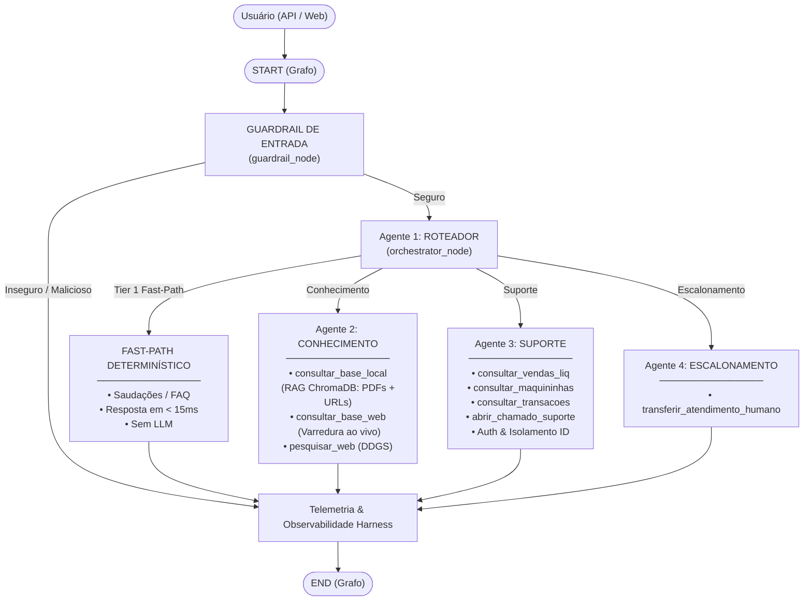

# Getnet Multi-Agent Customer Support System 🚀

Sistema multiagente corporativo de alta performance construído com **LangGraph**, **FastAPI**, **LangChain**, **ChromaDB** e **OpenAI**, desenvolvido para atender com excelência técnica, resiliência e conformidade integral ao desafio **Engenheiro de IA (Nível Avançado) – Sistema de Suporte Multiagente da Getnet**.

---

## 🏛️ Arquitetura e Orquestração Multiagente

O sistema adota um padrão de orquestração avançado com **Guardrails de Segurança**, **Roteador Semântico com Ancoragem Temporal Dinâmica**, **Tier 1 Fast-Path**, **3 Agentes Especialistas Cooperativos**, retenção de memória conversacional multi-turnos com `MemorySaver` e um módulo de inspeção técnica baseado no **Agent Harness (4 Pilares)**:



---

## 🤖 Os Especialistas do Grafo & Camada de Guardrails

### 🛡️ 1. Camada de Guardrails de Segurança (`guardrail_node`)
- **Papel:** Primeira barreira de defesa determinística de entrada do sistema.
- **Mecanismo:** Analisa a mensagem do usuário contra tentativas de *prompt injection*, *jailbreaks*, injeções de código/SQL, vazamento de instruções internas (*system prompt leak*), toxicidade e fraudes.
- **Comportamento:** Ao interceptar uma ameaça, encerra o grafo imediatamente (`guardrail_node ➔ END`), sem acionar o Orquestrador nem os especialistas, com latência de 0.0s e zero consumo de tokens desnecessários.

### 🧭 2. Agente Roteador (`orchestrator_node`)
- **Papel:** Ponto de entrada da orquestração inteligente e orquestrador de turnos.
- **Mecanismo:** Analisa a semântica da solicitação, o histórico multi-turnos e o identificador do cliente (`user_id`) para decidir deterministicamente qual especialista deve atender o turno (`knowledge`, `support` ou `escalation`), **sem gerar respostas conversacionais diretas nem chamar ferramentas**, garantindo separação estrita de responsabilidades.
- **Tier 1 Fast-Path:** Intercepta saudações frequentes, agradecimentos e confirmações simples via regex compiladas, retornando acolhimento padronizado em menos de 15ms.
- **Ancoragem Temporal Dinâmica:** Integra a função `get_system_clock_context()`, injetando dia da semana, data atual e ano do sistema em tempo real, permitindo que consultas relativas ("vendas de ontem", "previsão do tempo para amanhã", "fechamento recente") sejam roteadas com precisão sem datas fixas no código.

### 📚 3. Agente de Conhecimento (`knowledge_node`)
- **Papel:** Responde dúvidas institucionais, catálogo de maquininhas, taxas, crediário, Pix, antecipação e perguntas gerais de mundo aberto com arquitetura *Cache-First e Live Web Fallback*.
- **Arquitetura Cache-First com Short-Circuit:**
  - Opera com despacho sequencial determinístico (`parallel_tool_calls=False`).
  - Executa prioritariamente `consultar_base_local_getnet` (RAG vetorial no ChromaDB persistente).
  - Se a base local contiver os dados necessários com alto grau de confiança (ex: comparativos entre Get Clássica e Get Smart, taxas, prazos, especificações técnicas), o agente **encerra a busca imediatamente (Short-Circuit / Cache-Hit)** e sintetiza a resposta final, poupando chamadas web redundantes e reduzindo drasticamente a latência da requisição.
  - Apenas se a base local for insuficiente ou o tema exigir atualização externa ao vivo, aciona sequencialmente `consultar_base_web_getnet` (varredura nos portais Getnet) ou `pesquisar_web` (DuckDuckGo para câmbio, clima, etc.).
- **Citação Obrigatória de Fontes:** Toda resposta fundamentada em documentação oficial cita explicitamente arquivos ou URLs consultadas no rodapé (`📌 Fontes consultadas:`).
- **Ferramentas (`KNOWLEDGE_TOOLS`):**
  1. `consultar_base_local_getnet`: RAG vetorial no ChromaDB persistente com dados de documentos oficiais locais (`fonte_de_dados/`) e páginas web sincronizadas.
  2. `consultar_base_web_getnet`: Varredura em tempo real nas páginas e subpáginas dos portais oficiais Getnet (`RAG_SYNC_URLS`) quando a base interna local necessitar de atualização complementar.
  3. `pesquisar_web`: Busca na internet (DuckDuckGo) para cotações de moedas (ex: euro hoje), clima em tempo real e informações gerais fora do catálogo Getnet.

### 🛠️ 4. Agente de Suporte ao Cliente (`support_node`)
- **Papel:** Atendimento autenticado e personalizado utilizando o identificador do cliente (`user_id`).
- **Autenticação e LGPD Obrigatórias:** Exige validação de documento (CPF/ID) antes de expor extratos ou dados privados. Caso a mensagem não contenha identificação, bloqueia preventivamente o acesso a dados privados e solicita o documento.
- **Ferramentas Corporativas (`SUPPORT_TOOLS`):**
  1. `consultar_vendas_e_liquidacao`: Consulta vendas realizadas, liquidação bancária em conta cadastrada e prazos contratuais D+2.
  2. `consultar_status_maquininhas`: Diagnóstico de conectividade, intensidade de sinal (4G/Wi-Fi) e estado operacional dos terminais POS (Get Clássica, Get Smart, Get Mini, POS Digital).
  3. `consultar_transacoes_e_erros`: Diagnóstico detalhado de recusas de pagamento com código e orientação ao lojista (ex: Código 51 - Saldo Insuficiente).
  4. `consultar_chamados_suporte`: Histórico completo de chamados e solicitações abertas pelo lojista.
  5. `abrir_chamado_suporte`: Abertura formal de ticket técnico com número de protocolo oficial Getnet, motivo e prazo para reposição de bobinas térmicas, troca de leitor ou manutenção física.

### 👤 5. Agente de Escalonamento Humano (`escalation_node`)
- **Papel:** Transferência assistida e contextualizada para operadores humanos (**Human Handoff em tempo real**).
- **Mecanismo:**
  - Gera protocolo oficial de atendimento Getnet (`GET-2026-XXXX`).
  - Classifica a solicitação em **6 filas especializadas de atendimento**:
    - *Suporte Técnico N2 - Terminais*
    - *Segurança da Informação e Prevenção a Fraudes*
    - *Jurídico, Compliance e Regulatório*
    - *Mesa de Grandes Contas e Key Accounts*
    - *Mesa de Negócios e Tarifas*
    - *Ouvidoria e Atendimento Geral*
  - Aloca um operador disponível simulado (`OPERADORES_POR_FILA`), como *Carlos M. (Especialista POS)*, *Beatriz R. (Prevenção a Fraudes)*, *Dr. Eduardo P.*, *Juliana M.*, etc.
  - Transmite os dados do cliente e um **resumo executivo do caso** para a estação de trabalho do atendente com SLA estimado em tempo real.
- **Ferramentas (`ESCALATION_TOOLS`):**
  1. `transferir_atendimento_humano`: Executa o handoff assistido no canal seguro.

---

## 🔬 Observabilidade Técnica: Os 4 Pilares do Agent Harness

Abaixo de cada resposta da IA na interface visual, há um componente expansível de observabilidade e auditoria técnica que expõe os **4 Pilares do Harness**:

```
+-----------------------------------------------------------------------------------------+
|  🧠 Linha de Raciocínio: ⚡ 220ms  •  🪙 412 tokens  •  🧭 guardrail ➔ orchestrator  ▲  |
+-----------------------------------------------------------------------------------------+
```

Ao expandir o painel, são apresentados os 4 pilares em cards dedicados:

1. **Pilar 1 — Trajetória no Grafo & Tool Calls:**
   - Chips visuais coloridos exibindo a sequência real de nós executados pelo LangGraph (`guardrail ➔ orchestrator ➔ support`).
   - Relação das ferramentas corporativas acionadas no turno com nome da tool e parâmetros recebidos (`args`).
2. **Pilar 2 — Isolamento & Estado Persistido no StateGraph:**
   - Contagem de turnos ativos no chat versus mensagens acumuladas no buffer do ReAct.
   - Chips discriminando perguntas humanas, respostas geradas pela IA e passos intermediários de ferramentas.
   - Snapshot 100% real das variáveis ativas salvas na memória (`categoria_ativa`, `cliente_autenticado`, `protocolo_chamado`, `fila_atendimento`).
3. **Pilar 3 — Contenção de Mutações (Sandbox Enforcement):**
   - Distinção explícita entre operações de **Leitura Pura** (consultas a extratos e status) e **Mutações Executadas** (inserção de chamados na base SQLite local).
   - Confirmação de conformidade estrita com LGPD e PCI-DSS em ambiente Sandbox.
4. **Pilar 4 — Governança, Custos & Guardrails:**
   - Auditoria de segurança na entrada (`✅ Seguro` vs `🚨 Interceptação Ativada`).
   - Latência total de execução em milissegundos.
   - Consumo de tokens (Prompt + Completion) e custo financeiro estimado em dólares (USD).

---

## 🧠 Linha de Raciocínio Dinâmica (Live Reasoning & Execution Tree)

O sistema conta com dois níveis de transparência do raciocínio da IA:

### 1. Indicador em Tempo Real (`LiveReasoningTrace`)
Durante o processamento da requisição, a barra de progresso identifica em tempo real a intenção da mensagem e exibe etapas contextuais correspondentes:
- **Testes de Injeção / Segurança:** Exibe inspeção de conformidade e integridade do Guardrail.
- **Demandas Financeiras / Suporte:** Exibe validação cadastral (LGPD) e consulta a serviços transacionais.
- **Pedidos de Atendente:** Exibe triagem de fila prioritária e preparação de protocolo oficial.
- **Perguntas Externas (Câmbio / Tempo):** Exibe busca web em tempo real via DuckDuckGo.
- **Dúvidas de Produtos Getnet:** Exibe busca em manuais técnicos e documentação oficial.

### 2. Árvore de Raciocínio Final (`formatReasoningTree`)
Assim que a resposta retorna, a árvore hierárquica reflete com exatidão matemática o que o grafo executou:
- Se foi bloqueado pelo Guardrail, **encerra imediatamente no nó de Segurança**, sem exibir falsamente nós posteriores.
- Se acionou o Agente de Suporte, detalha as ferramentas executadas (`consultar_vendas_e_liquidacao`, `consultar_status_maquininhas`) e a síntese transacional.
- Se acionou o Agente de Conhecimento, exibe a numeração estritamente sequencial das etapas (Base Local ➔ Crawler Web ➔ Síntese Anti-Alucinação).
- Se acionou acolhimento direto sem ferramentas (ex: *"Boa noite"*), declara com transparência que se tratou de acolhimento institucional direto sem consulta vetorial.

---

## 🔄 Pipeline de RAG Híbrido e Ingestão Inteligente

O sistema conta com uma infraestrutura de RAG de alta disponibilidade e custo computacional otimizado:

1. **Ingestão de Arquivos Locais (`fonte_de_dados/`):**
   - Suporte a múltiplos formatos: `.pdf`, `.docx`, `.txt`, `.md`, `.csv`, `.json`, `.log`.
   - **Deduplicação com Hash MD5:** Tabela SQLite `simple_sync_hashes` armazena a assinatura criptográfica de cada arquivo. Arquivos inalterados são ignorados instantaneamente na inicialização, economizando chamadas de embedding. Se alterados, os chunks obsoletos são expurgados do ChromaDB e substituídos pelos novos.
2. **Crawler Recursivo de URLs Parametrizadas:**
   - Varredura assíncrona das URLs raiz configuradas no `.env` (`RAG_ASYNC_URLS`) com profundidade configurável (`RAG_CRAWLER_MAX_DEPTH`) e limite de páginas (`RAG_CRAWLER_MAX_PAGES`).
   - Normalização e limpeza de HTML via `BeautifulSoup`.
   - Tabela SQLite `url_sync_hashes` garante que páginas da web inalteradas não gerem custos adicionais. Se o conteúdo for modificado na web, o sistema invalida a versão anterior no ChromaDB e re-indexa.
3. **Sincronização em Background no Startup (`lifespan`):**
   - Ao iniciar a aplicação FastAPI, a rotina `run_startup_enrichment()` é disparada assincronamente em segundo plano com controle de concorrência (`threading.Lock`), permitindo que a API fique disponível para requisições imediatamente.
4. **Endpoints Administrativos de Gestão da Base RAG:**
   - `POST /api/v1/admin/upload-files-rag`: Upload direto de novos documentos via API/Swagger com streaming e validação de tamanho (até 50MB).
   - `POST /api/v1/admin/sync-web`: Disparo manual sob demanda com controle de escopo (`target: all | files | urls`) e modo forçado (`force: true | false`).

---

## 💻 Interface Visual Moderna (Frontend SaaS)

O frontend foi desenvolvido com foco em alta produtividade, estética limpa e **zero dependências externas pesadas**:

- **Barra Lateral Retrátil com Múltiplas Sessões em Memória:**
  - Gerenciamento completo de sessões no estado da aplicação (`React State`), cada qual com seu `thread_id` isolado para manter memórias e contextos independentes.
  - Títulos de sessão auto-gerados com base na primeira mensagem do usuário.
  - Exclusão individual de conversas (ícone de lixeira `🗑️`) e botão global *"Limpar Todas as Conversas"* com alerta de confirmação.
- **Painel de Casos de Teste Oficiais do Edital (15 Cenários Ancorados):**
  - Acordeão retrátil na barra lateral contendo os 15 casos de teste oficiais do edital, prontos para execução em 1 clique (Prompt Injection, Depósito de Vendas com ID, Cotação do Euro, Falha de Conexão POS, etc.).
- **Micro-Parser de Markdown Nativo:**
  - Renderiza **negrito**, *itálico*, `código inline`, citações (`> blockquote`), listas com marcadores, cabeçalhos hierárquicos e o bloco destacado de *"📌 Fontes consultadas"* sem vulnerabilidades XSS.
- **Badges Semânticos dos Agentes:**
  - Identificação visual imediata de qual agente especialista respondeu cada turno (`Conhecimento`, `Suporte ao Cliente`, `Escalonamento Humano`, `Segurança & Políticas`), além de pílulas indicando as ferramentas corporativas acionadas.
- **Dashboard Integrado de Telemetria & Observabilidade Operacional (`/dashboard/`):**
  - **Controle Dual-Mode de Ambiente:**
    - 🟢 **Modo Produção (100% Real SQLite):** Conectado diretamente à telemetria real (`bds/telemetry.sqlite`) e RAG (`bds/rag_sync.sqlite`). Se não houver chamados escalonados ou bloqueios, exibe com fidelidade `0` ou `Sem registros`, sem mascarar o estado real da operação nem gerar dados fictícios.
    - 🟣 **Modo Desenvolvimento (Baseline Simulado Ilustrativo):** Preenche os quadros e gráficos com métricas ilustrativas calibradas para demonstração visual, layout e validação de interfaces.
  - **Quadro "Status da Base RAG & Deduplicação":**
    - Exibe a proveniência e integridade dos dados diretamente de `bds/rag_sync.sqlite`:
      - *Arquivos Locais Processados:* Tabela `simple_sync_hashes` (assinaturas MD5 dos documentos da pasta `fonte_de_dados/` com sincronização incremental).
      - *Páginas Web Rastreadas:* Tabela `url_sync_hashes` (URLs oficiais Getnet indexadas e sincronizadas via crawler assíncrono).
  - **Quadro "Filas de Transbordo Humano":**
    - Contabiliza os atendimentos transferidos por fila corporativa Getnet, filtrando estritamente transferências confirmadas com número de protocolo gerado (`protocol IS NOT NULL`), distribuídas entre as 6 filas oficiais.
  - **Cards Comparativos de Segurança:**
    - *Alertas de Guardrails:* Bloqueios determinísticos de injeção de prompt, jailbreak, SQLi, tentativa de extração de system prompt e ameaças.
    - *Mensagens Fora do Escopo:* Registro de interações que não são ameaças, mas fogem do domínio do negócio de adquirência Getnet.
  - **Métricas de Performance e Tráfego:**
    - Distribuição percentual de requisições por agente e latência P95 por nó do LangGraph.
    - Gráfico dinâmico de Requisições / Minuto vs Latência P95.

---

## 🚀 Como Executar o Projeto

### Opção A: Execução via Docker Compose (Recomendada)

Com apenas um comando, o Docker Compose compila e inicializa tanto a **API Backend** quanto a **Interface Web Frontend**:

1. Certifique-se de que o Docker e Docker Compose estão instalados.
2. Configure o arquivo `.env` com sua chave da OpenAI:
   ```bash
   cp .env.example .env
   # Edite o .env e adicione sua OPENAI_API_KEY
   ```
3. Construa e suba os containers:
   ```bash
   docker compose up --build
   ```
4. Acesse os serviços no navegador:
   - **Interface Web do Chat (Frontend Dedicado):** [http://localhost:3001](http://localhost:3001)
   - **Interface Web Integrada na API:** [http://localhost:8001/chat/](http://localhost:8001/chat/)
   - **Dashboard de Telemetria & Observabilidade:** [http://localhost:8001/dashboard/](http://localhost:8001/dashboard/)
   - **Swagger UI (Documentação Interativa):** [http://localhost:8001/docs](http://localhost:8001/docs)
   - **Health Check da API:** [http://localhost:8001/health](http://localhost:8001/health)

---

### Opção B: Execução Local no Ambiente Virtual

1. **Clone o repositório e crie o ambiente virtual:**
   ```bash
   python -m venv .venv
   .\.venv\Scripts\activate       # No Windows
   # source .venv/bin/activate    # No Linux/Mac
   ```

2. **Instale as dependências:**
   ```bash
   pip install -r requirements.txt
   ```

3. **Configure as variáveis de ambiente:**
   ```bash
   cp .env.example .env
   # Adicione sua OPENAI_API_KEY no arquivo .env
   ```

4. **Inicie o Servidor Backend (FastAPI na porta 8001):**
   ```bash
   uvicorn backend.main:app --host 0.0.0.0 --port 8001 --reload
   ```

5. **Inicie o Servidor Frontend (em outro terminal, na porta 3001):**
   ```bash
   python -m http.server 3001 --directory frontend
   ```
   Acesse a interface em: [http://localhost:3001](http://localhost:3001) ou [http://localhost:8001/chat/](http://localhost:8001/chat/)

---

### Opção C: Terminal Interativo CLI

Para testar diretamente os agentes via linha de comando sem necessidade de subir a interface gráfica:
```bash
python backend/cli.py
```

---

## 🧪 Bateria de Testes Automatizados (Arquitetura Sequencial de 4 Camadas)

O sistema possui uma suíte de testes de nível industrial com `pytest`, organizada em uma **Arquitetura Sequencial de 4 Camadas**:

```bash
# Ativação do ambiente virtual (se necessário):
# .\.venv\Scripts\activate   # Windows
# source .venv/bin/activate  # Linux/Mac

# Execução recomendada via módulo python (garante PYTHONPATH configurado):

# Camada 1: Cenários Oficiais e Bônus do Edital (27 casos)
python -m pytest tests/test_01_edital_scenarios.py -v

# Camada 2: Especialistas do Grafo (17 casos)
python -m pytest tests/test_02_agents.py -v

# Camada 3: Ferramentas Internas e Crawler (61 casos)
python -m pytest tests/test_03_tools_and_internal.py -v

# Camada 4: Robustez Conversacional Profunda Multi-turnos (50 casos / 210 turnos)
python -m pytest tests/test_04_multiturn_harness.py -v
# ou execução direta com gravação de dossiê executivo em Markdown e JSON:
python tests/test_04_multiturn_harness.py

# Bateria Completa (> 155 testes)
python -m pytest -v

# Testando um Agente/Especialista específico (filtro por nome com -k):
python -m pytest tests/test_02_agents.py -k "TestKnowledgeAgent" -v
python -m pytest tests/test_02_agents.py -k "TestSupportAgent" -v
python -m pytest tests/test_02_agents.py -k "TestEscalationAgent" -v
python -m pytest tests/test_02_agents.py -k "TestGuardrailAgent" -v
python -m pytest tests/test_02_agents.py -k "TestOrchestratorAgent" -v
```

### Cobertura das Suítes de Teste:

| Camada / Arquivo de Teste | Qtd. Casos | Foco da Validação e Cobertura |
|---|:---:|---|
| **`tests/test_01_edital_scenarios.py`** | 27 casos | **Cenários Oficiais e Bônus do Edital** (10 obrigatórios + 17 regras de negócio, KYC e guardrails) |
| **`tests/test_02_agents.py`** | 17 casos | **Especialistas do Grafo**: Guardrail (anti-abuso), Orchestrator (roteamento), Knowledge (RAG/Web), Support (KYC/chamados) e Escalation (triagem 3 níveis) |
| **`tests/test_03_tools_and_internal.py`** | 61 casos | **Ferramentas Internas**: Fast-Path regex (<15ms), crawler web/Base64, endpoint admin upload multipart e RAG SQLite |
| **`tests/test_04_multiturn_harness.py`** | 50 casos | **Robustez Multiturno Profunda (3 a 6 turnos)**: 210 turnos de diálogo, retenção de memória com `MemorySaver`, isolamento e Dossiê Executivo automatizado |
| *Wrappers Retrocompatíveis:* | - | `test_scenarios.py` e `test_robustness_multiturn_50.py` mantêm 100% de compatibilidade com comandos legados |

### 📑 Geração de Relatórios e Dossiês Executivos:
- **Centralizador de Relatórios:** `tests/reporters/dossier_generator.py` consolida os resultados em formato corporativo para apresentação técnica e auditoria.
- **Artefatos Gerados:**
  - `tests/reports/relatorio_multiturn_harness_latest.md` (Sumário executivo, SLA P95, aprovação e trajetória dos agentes)
  - `tests/reports/relatorio_multiturn_harness_latest.json` (Métricas estruturadas em JSON)
  - `tests/reports/relatorio_testes_multiturn_latest.md` (Dossiê granular turno a turno com todas as perguntas, respostas e ferramentas)

---

## 📡 Contrato e Especificação da API

### `POST /api/v1/chat`

Endpoint principal de conversação validado estritamente pelos schemas Pydantic `ChatRequest` e `ChatResponse`:

**Exemplo de Requisição (JSON):**
```json
{
  "message": "Quando o dinheiro das vendas de ontem será depositado? Meu ID é: cliente1988",
  "user_id": "cliente1988",
  "thread_id": "sessao_abc123"
}
```

**Exemplo de Resposta (JSON):**
```json
{
  "response": "Olá! Verifiquei o extrato financeiro da sua conta (Comércio Silva & Santos Ltda). As vendas líquidas de ontem no valor de R$ 1.205,50 têm previsão de depósito para amanhã até às 18h na sua conta cadastrada no Banco Santander (Agência 1234, Conta 98765-4), conforme o prazo contratual de liquidação D+2.",
  "agent_used": "support",
  "category": "Financeiro/Extrato",
  "tools_used": [
    "consultar_vendas_e_liquidacao"
  ],
  "trace": {
    "turn_count": 1,
    "thread_id": "web_sessao_abc123",
    "user_id": "cliente1988",
    "execution_mode": "SANDBOX_SQLITE_LOCAL",
    "side_effects_prevented": true,
    "mutation_performed": false,
    "authenticated": true,
    "nodes_visited": [
      "guardrail_node",
      "orchestrator_node",
      "support_node"
    ],
    "tool_calls": [
      {
        "tool": "consultar_vendas_e_liquidacao",
        "args": { "user_id": "cliente1988" }
      }
    ],
    "latency_ms": 284.5,
    "estimated_tokens": 420,
    "estimated_cost_usd": 0.000125,
    "guardrail_safe": true,
    "agent_used": "support",
    "tools_used": [
      "consultar_vendas_e_liquidacao"
    ]
  }
}
```

### Endpoints Administrativos e de Operação:
- `POST /api/v1/admin/upload-files-rag`: Upload multipart de novos arquivos para a pasta `fonte_de_dados/`.
- `POST /api/v1/admin/sync-web?target=all&force=false`: Disparo de sincronização e vetorização da base RAG.
- `GET /api/v1/admin/dashboard-stats`: Métricas de latência, taxa de acerto e telemetria operacional.
- `GET /health`: Verificação de status e versão da aplicação.
